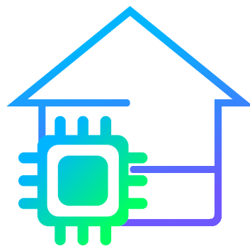

# Smarthome-hw
 Hardware interface for the Smarthome server



### Token 🔑
In order to guarantee a safe communication between the `smarthome` server and the `smarthome-hw` server, a token is required.
When this application is first started, a *random* token will be generated and printed to the server's logs (**but not to file**).
#### Change token ↺
In order to change the default token, use the provided bash script:
```bash
./update_token.sh "old_token" "new_token"
```

## Api

To send a power request, make a **POST** request to a similar url with a similar request body encoded as `application/json`
```
http://localhost:8081/power?token=smarthome
```

```json
{
	"switch": "s1",
	"power": true
}
```
